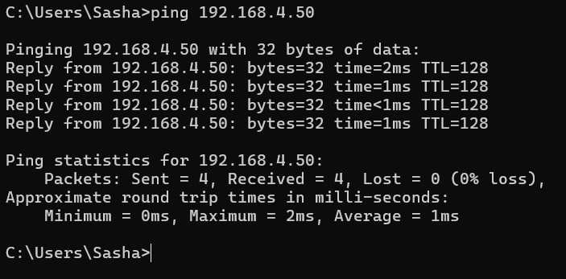
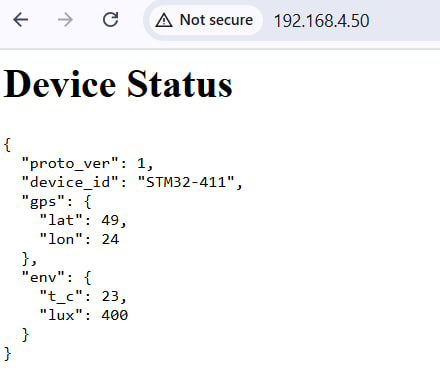
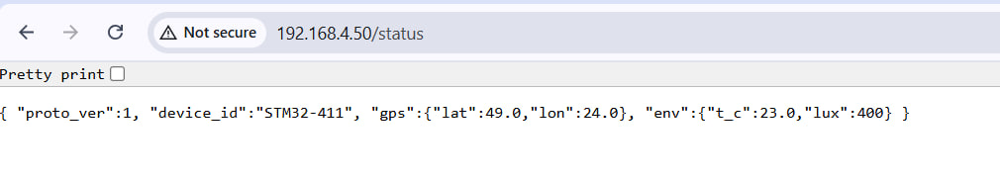
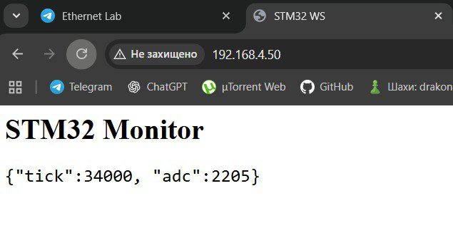
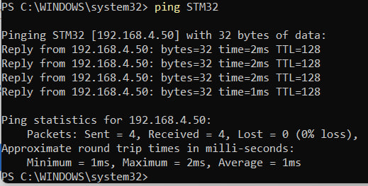

## Lab Ethernet

### Підйом мережі Ethernet

### Коректне надсилання Json та коректна версія + Оновлення веб сторінки

### Режим без DHCP

Присутнє, через 10 секнуд без відповіді від DHCP сервера, мікроконтролер отримує IP адресу 192.168.4.50

### Веб сокет для оновлень

### LLMNR працює ping STM32

